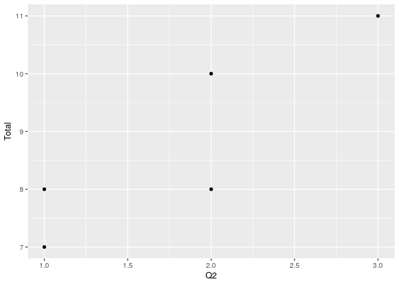
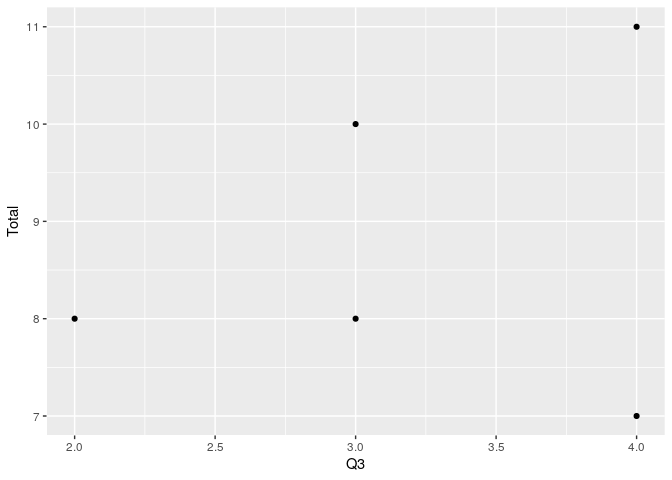

<!-- README.md is generated from README.Rmd. Please edit that file -->

# examstats

<!-- badges: start -->

<!-- badges: end -->

The goal of examstats is to assist in understanding exam grades.

## Installation

You can install the development version of `examstats` from
[Github](https://github.com/nxskok/examstats) with:

``` r
devtools::install_github("nxskok/examstats")
```

## Example

The package includes a small made-up data set of grades to play with:

``` r
library(examstats)
library(ggplot2)
test_grades
#> # A tibble: 5 x 4
#>      Q1    Q2    Q3 Total
#>   <dbl> <dbl> <dbl> <dbl>
#> 1     5     2     3    10
#> 2     4     2     2     8
#> 3     4     3     4    11
#> 4     2     1     4     7
#> 5     4     1     3     8
```

The data layout is: a row for each student, a column for each question,
and an additional column with the total mark for each student. The
questions could be out of several marks, or they could be multiple
choice questions that are either right (1) or wrong (0). This is the
ormat that comes out of Crowdmark (“save grades as CSV”); that has some
additional columns on the front identifying the students which will need
to be removed first. The column of totals has to be called `Total`.

The first thing you might want to do is to summarize the total marks,
thus:

``` r
make_stats(test_grades)
#>   0%  25%  50%  75% 100% 
#>    7    8    8   10   11
```

This uses `quantile`; it is written so that you can pass to this
function whatever you would pass to `quantile`:

``` r
make_stats(test_grades, c(0.10, 0.90))
#>  10%  90% 
#>  7.4 10.6
```

The 10th and 90th percentiles.

I actually wrote the package to compute what the average percent correct
was for each question and the item-total correlation (which shows how
well a question discriminates between the top and bottom students):

``` r
make_all(test_grades)
#> Joining, by = "q"
#> Joining, by = "q"
#> # A tibble: 3 x 3
#>   q      hard   cor
#>   <chr> <dbl> <dbl>
#> 1 Q1     76   0.667
#> 2 Q2     60.0 0.873
#> 3 Q3     80   0.218
```

Question 2 is both the hardest and the most discriminating:

``` r
ggplot(test_grades, aes(x=Q2, y=Total)) + geom_point()
```



The highest scorer on question 2 was the highest scorer on the exam,
while the two lowest scorers on question 2 were among the lowest scorers
on the exam also.

Question 3, on the other hand, is not very discriminating:

``` r
ggplot(test_grades, aes(x=Q3, y=Total)) + geom_point()
```



Out of the two people who scored 4, one was the highest scorer overall,
and one was the lowest. Typically, a question like this is either
testing something else, or was confusing to the students.

## Other functions

The functions that calculate the hardness values and the item-total
correlations are both available individually. These take a long-format
data set with all the marks in one column; there is also a function to
make that.

``` r
test_long <- make_long(test_grades)
test_long
#> # A tibble: 15 x 3
#>    Total q      mark
#>    <dbl> <chr> <dbl>
#>  1    10 Q1        5
#>  2    10 Q2        2
#>  3    10 Q3        3
#>  4     8 Q1        4
#>  5     8 Q2        2
#>  6     8 Q3        2
#>  7    11 Q1        4
#>  8    11 Q2        3
#>  9    11 Q3        4
#> 10     7 Q1        2
#> 11     7 Q2        1
#> 12     7 Q3        4
#> 13     8 Q1        4
#> 14     8 Q2        1
#> 15     8 Q3        3
```

and then

``` r
make_hardness(test_long)
#> Joining, by = "q"
#> # A tibble: 3 x 2
#>   q      hard
#>   <chr> <dbl>
#> 1 Q1     76  
#> 2 Q2     60.0
#> 3 Q3     80
```

and

``` r
make_discrim(test_long)
#> # A tibble: 3 x 2
#>   q       cor
#>   <chr> <dbl>
#> 1 Q1    0.667
#> 2 Q2    0.873
#> 3 Q3    0.218
```

`make_hardness` currently assumes that the maximum score on a question
out of all the students is equal to the maximum score for the question.
This can be improved.
